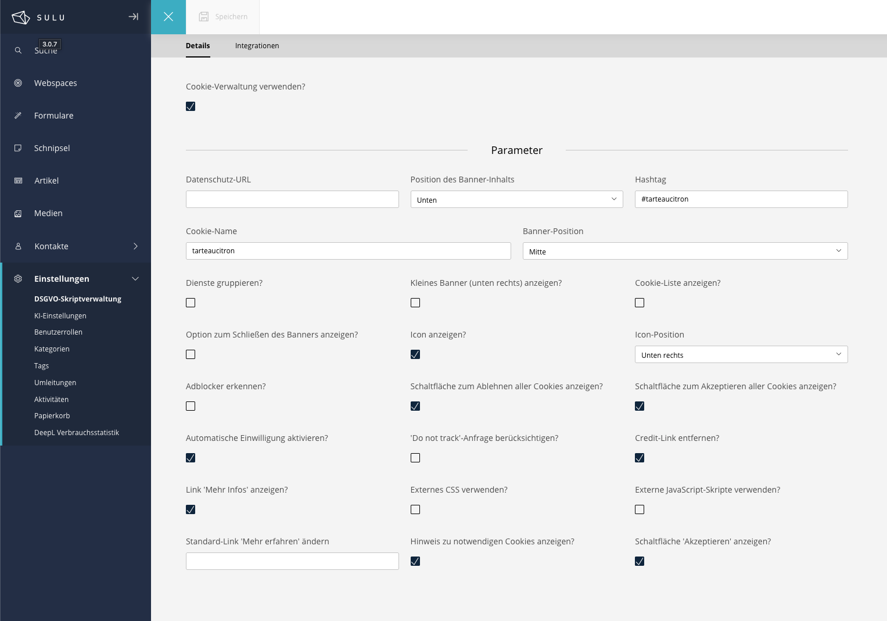
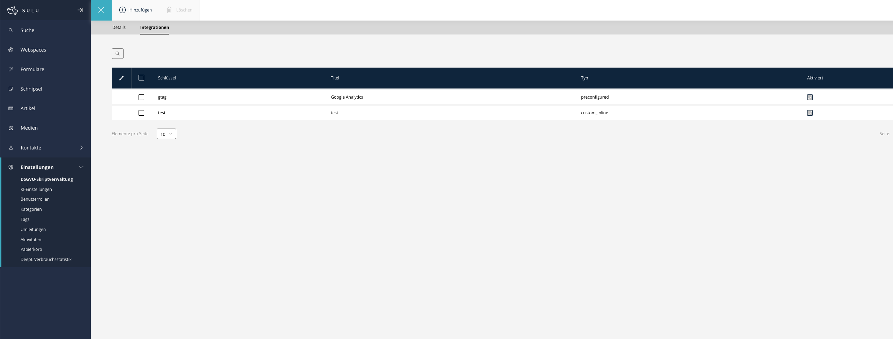
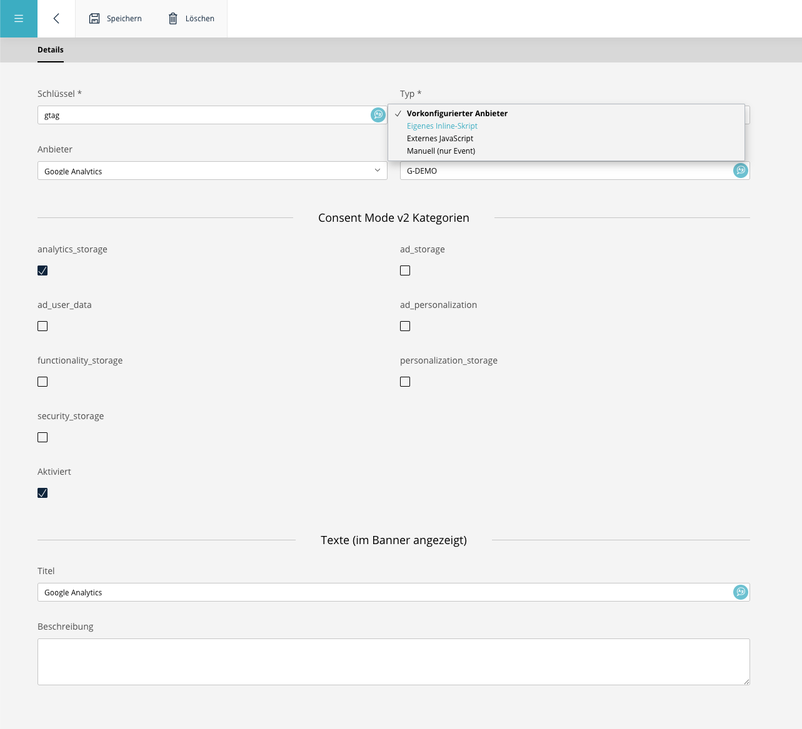

# Sulu GDPR bundle


[](https://sulu.io/)
[](https://sonarcloud.io/summary/new_code?id=Pixel-Open_sulu-gdprbundle)

## Presentation

A Sulu bundle to easily manage the GDPR.
It also allows you to manage the consent banner by using the [Tarteaucitron](https://github.com/AmauriC/tarteaucitron.js/) consent management system.


## Requirements

* PHP >= 8.2
* Sulu >= 3.0.*
* Symfony >= 6.4
* Composer

## Installation

### Install the bundle

Execute the following [composer](https://getcomposer.org/) command to add the bundle to the dependencies of your
project:

```bash
composer require pixelopen/sulu-gdprbundle
```

### Enable the bundle

Enable the bundle by adding it to the list of registered bundles in the `config/bundles.php` file of your project:

 ```php
 return [
     /* ... */
     Pixel\GDPRBundle\GDPRBundle::class => ['all' => true],
 ];
 ```

### Update schema (for dev environnement)

Sulu uses two kernels, so run the schema update on the admin console:

```shell script
bin/adminconsole doctrine:schema:update --force
```

### Publish the assets

The bundle ships the Tarteaucitron library and the consent runtime (`gdpr-consent.js`).
Publish them to your `public/` directory, otherwise the banner cannot load:

```shell script
bin/adminconsole assets:install --symlink
```

## Bundle Config

Import the bundle's Admin API routes in `routes_admin.yaml`
```yaml
gdpr_admin_api:
  resource: '@GDPRBundle/Resources/config/routing_admin.yaml'
  prefix: /admin/api
```

### Render the banner

Call the `gdpr_script()` Twig function in the `<head>` of your layout (e.g. `master.html.twig`).
It renders nothing until you enable "Use cookies management?" in the settings.

```twig
<head>
    {# ... #}
    {{ gdpr_script() }}
</head>
```

### Permissions

The bundle registers the `gdpr_settings.settings` security context. Grant your role **View**,
**Add**, **Edit** and **Delete** for it under *Settings → Roles*, otherwise the GDPR settings and
integrations are hidden or read‑only.

## Upgrading from v1 (single tracker → integrations)

v2 replaces the fixed provider fields (single Google Analytics code, etc.) with the
**Integrations** list. If you have v1 data, migrate it **before** the schema drops the old columns:

```shell script
# 1. create the new tables WITHOUT dropping the legacy columns yet
bin/adminconsole doctrine:schema:update --dump-sql      # review
#    run only the "CREATE TABLE gdpr_integration ..." statements, or use a migration

# 2. copy the legacy tracking codes into integrations
bin/adminconsole gdpr:integrations:migrate-settings     # --locales=de,en

# 3. now let the schema drop the legacy columns and add foreign keys
bin/adminconsole doctrine:schema:update --force
```

On a fresh install (no v1 data) just run `bin/adminconsole doctrine:schema:update --force`.

Because the Integrations list adds create/delete operations to the existing
`gdpr_settings.settings` security context, grant **Add** and **Delete** for that context to your
role under *Settings → Roles* after upgrading (an existing context does not auto‑grant newly added
permission types).

## Use
The bundle is only composed of the settings, which make the management of the GDPR very easy.

To use the GDPR management of the bundle, just check the "Use cookies management?". All the other options should be display.

The **Parameters** section will help you manage the Tarteaucitron banner, which displays the consent banner.

**Privacy page:** select the privacy policy page in *Privacy page*; the banner links it in the visitor's language
(e.g. `/de/datenschutz` and `/en/datenschutz`). *Privacy URL* is only used when no page is selected, e.g. for an
external link. After updating, add the new column with `bin/adminconsole doctrine:schema:update --force`
(`gdpr_settings.privacy_page`).
There are plenty of parameters, so don't hesitate to visit the repository of Tarteaucitron.



The **Integrations** tab is where you add the individual scripts/services that the banner asks
consent for (see below).

## Integrations

Each tracker, script or embed you want to gate behind consent is configured as an **integration**
on the **Integrations** tab of the GDPR settings. The list is localized — use the language switcher
to edit the texts shown in the banner per language.



Click **Add** (or a row) to open the full‑page form. The **Type** field decides which other fields
are shown:



| Type | What it does | Fields |
|------|--------------|--------|
| **Preconfigured provider** | Wires a known provider into Tarteaucitron for you. | *Provider* (Google Analytics, Google Tag Manager, Google Ads, Bing Ads, Facebook Pixel) + *Tracking ID* |
| **Custom inline script** | Runs the pasted JavaScript when the integration is accepted. | *Inline script* |
| **Custom external JS** | Injects `<script src="…">` when the integration is accepted. | *Script URL* |
| **Manual (event only)** | Stores no code — only emits the accept/reject event so you can run your own code (e.g. a map you built yourself). | – |

Common fields for every type:

* **Key** — a unique slug (e.g. `googlemaps`). It is the Tarteaucitron service key **and** the
  suffix of the JavaScript events (`gdpr:accept:<key>`).
* **Consent Mode v2 categories** — the Google Consent Mode v2 signals that are set to `granted`
  when the integration is accepted (`analytics_storage`, `ad_storage`, …). Preconfigured providers
  get sensible defaults.
* **Enabled** — only enabled integrations are rendered on the frontend.
* **Title / Description** — the localized texts shown in the consent banner.

### Reacting to consent on the frontend

The bundle exposes a small JavaScript API so your own code can react when an integration is
accepted or rejected. This is the recommended way to gate a **Manual** integration:

```js
// run your code once the visitor accepts the "googlemaps" integration
window.gdpr.onAccept('googlemaps', function () {
    initMyMap();
});

window.gdpr.onReject('googlemaps', function () {
    // optional clean-up
});
```

For a **custom consent UI** (your own banner instead of tarteaucitron's), the runtime also exposes:

```js
window.gdpr.integrations(); // [{ key, title, description, type, provider, consentCategories, needConsent }]
window.gdpr.choice('googlemaps'); // true | false | null (not decided yet)
window.gdpr.set('googlemaps', true); // accept (true) or decline (false), stored like the banner's switch
```

`onAccept` callbacks registered *after* the visitor already accepted are fired immediately. The same
signals are also dispatched as DOM events on `document`, if you prefer listening to those:

```js
document.addEventListener('gdpr:accept:googlemaps', function (e) { /* e.detail.key === 'googlemaps' */ });
document.addEventListener('gdpr:reject:googlemaps', function () { /* … */ });
```

### Twig extension
The bundle comes with two twig functions:

**gdpr_settings()**: returns the banner settings of the bundle. No parameters are required.

Example of use:
```twig

{{ gdprSettings.useCookieHandling }}
```

**gdpr_script()**: renders the consent banner, the enabled integrations and the consent runtime.
No parameters are required — it reads the current request locale for the banner texts. Place it in
the `<head>` of your layout.

Example of use:
```twig
{{ gdpr_script() }}
```

## Contributing
You can contribute to this bundle. The only thing you must do is respect the coding standard we implements.
You can find them in the `ecs.php` file.
